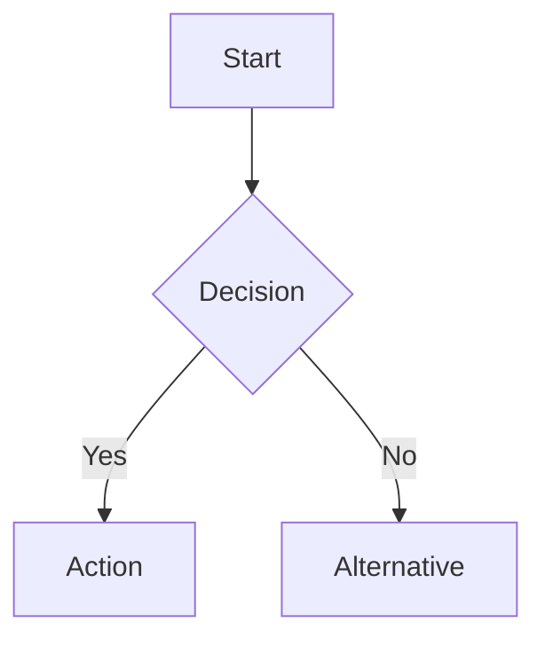
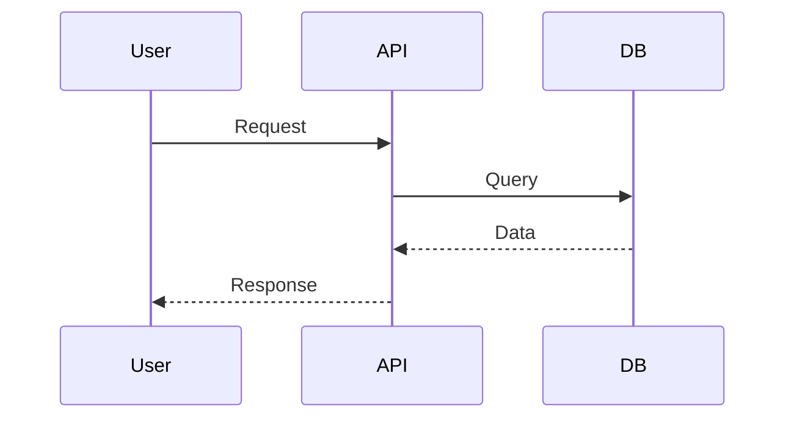
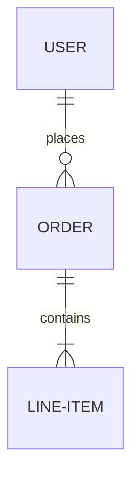
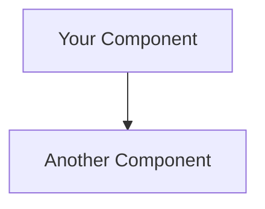

# HLD Mermaid Diagrams Update - Summary

## ✅ What Was Done

I've updated the Checkmate High-Level Design (HLD) document to use **professional Mermaid diagrams** instead of ASCII art, making the documentation more visual, interactive, and modern.

## 🎨 Diagrams Updated

### 1. **System Architecture** ✅
- **Type:** Graph (TB - Top to Bottom)
- **Shows:** Complete system architecture with layers
  - Client Layer (Browser, Postman, External Integrations)
  - Application Server (Presentation, Business Logic, Data Access)
  - Database Layer (MySQL)
  - External Services (Google OAuth, Casbin)
- **Features:** 
  - Color-coded subgraphs
  - Emoji icons for visual clarity
  - Clear data flow arrows
  - Dotted lines for external dependencies

### 2. **User Request Flow** ✅
- **Type:** Sequence Diagram
- **Shows:** Step-by-step flow from browser to database
  - Browser → React Component
  - Form submission → Remix Route
  - Authentication & Authorization
  - Business logic → DAO → Database
  - Response back to browser
- **Features:**
  - Sequential numbering
  - Clear participant roles
  - Request/response flow

### 3. **API Request Flow** ✅
- **Type:** Sequence Diagram  
- **Shows:** External API integration flow
  - HTTP Request + Bearer Token
  - Token validation
  - Casbin permission check
  - Alt/Else for denied/granted scenarios
- **Features:**
  - Conditional logic (alt/else)
  - Error handling paths
  - Success/failure flows

### 4. **Database Entity Relationship** ✅
- **Type:** ER Diagram
- **Shows:** Complete database schema
  - All core entities (Organization, Projects, Tests, Runs, Users, etc.)
  - Relationships (1:N, N:M)
  - Field definitions with types and constraints
- **Features:**
  - Cardinality notation (||--o{, }o--o{)
  - Relationship labels ("has", "contains", "belongs to")
  - Complete field specifications

### 5. **Authentication Flow** ✅
- **Type:** Flowchart (TD - Top Down)
- **Shows:** Google OAuth authentication process
  - User login
  - Google OAuth redirect
  - Callback handling
  - User creation/retrieval
  - Session creation
  - Redirect to dashboard
- **Features:**
  - Decision nodes (User in DB?)
  - Conditional paths
  - Color-coded steps
  - Emoji for clarity

### 6. **API Layers** ✅
- **Type:** Flowchart (TD)
- **Shows:** API request processing layers
  - API Endpoint
  - Authentication
  - Authorization
  - Input Validation
  - Business Logic
  - Data Access
  - Response Handler
- **Features:**
  - Sequential flow
  - Color-coded layers
  - Emoji icons
  - Clear processing pipeline

### 7. **Docker Container Structure** ✅
- **Type:** Graph (LR - Left to Right)
- **Shows:** Docker Compose architecture
  - checkmate-app container
  - checkmate-db container
  - db_seeder container
  - Client connections
- **Features:**
  - Subgraphs for containers
  - Connection arrows (SQL queries, HTTP)
  - Dotted lines for seeding

### 8. **Security Architecture** ✅
- **Type:** Flowchart (TD)
- **Shows:** Multi-layer security model
  - Network Layer
  - Authentication Layer
  - Authorization Layer
  - Input Validation Layer
  - Data Access Layer
- **Features:**
  - Dotted annotations for details
  - Color-coded layers
  - Sequential flow
  - Security measures per layer

### 9. **Test Pyramid** ✅
- **Type:** Graph (TD)
- **Shows:** Testing strategy hierarchy
  - E2E Tests (Few)
  - Integration Tests (Some)
  - Unit Tests (Many)
- **Features:**
  - Pyramid visualization
  - Color-coded layers
  - Emoji icons
  - Clear descriptions

## 🎯 Benefits of Mermaid Diagrams

### Visual Excellence
- ✨ **Professional Appearance** - Clean, modern diagram rendering
- 🎨 **Color Coding** - Different colors for different components
- 🖼️ **Consistent Styling** - Uniform look across all diagrams
- 📊 **Clear Relationships** - Easy to follow arrows and connections

### Interactive Features
- 🔍 **Zoomable** - Can zoom in/out on complex diagrams
- 🖱️ **Hover Effects** - Interactive elements
- 📱 **Responsive** - Works on all screen sizes
- 🌓 **Theme Support** - Adapts to dark/light mode

### Maintenance Benefits
- ✏️ **Easy to Edit** - Simple text-based syntax
- 📝 **Version Control** - Git-friendly (no binary images)
- 🔄 **Auto-Rendering** - Automatically rendered by Starlight
- 🚀 **Fast Loading** - No external images to load

### Developer Experience
- 💻 **Code-like Syntax** - Familiar to developers
- 📚 **Well-Documented** - Mermaid has extensive docs
- 🔧 **Customizable** - Easy to modify and extend
- 🎓 **Easy to Learn** - Simple, intuitive syntax

## 📊 Diagram Statistics

```
Total Diagrams Updated: 9

By Type:
├── Flowcharts: 4 (Architecture, Auth Flow, API Layers, Security)
├── Sequence Diagrams: 2 (User Flow, API Flow)
├── ER Diagram: 1 (Database)
├── Graph Diagrams: 2 (Docker, Test Pyramid)
```

## 🎨 Color Scheme Used

```
#e3f2fd - Light Blue (Client, Network)
#fff3e0 - Light Orange (Auth, Integration)
#f3e5f5 - Light Purple (Database, Services)
#e8f5e9 - Light Green (Success, Validation)
#fce4ec - Light Pink (Authorization, E2E)
#e0f2f1 - Light Teal (Data Access)
#fff9c4 - Light Yellow (Response)
#c8e6c9 - Dark Green (Completed States)
```

## 📝 Syntax Examples

### Flowchart


### Sequence Diagram


### ER Diagram


## 🔗 Resources

### Mermaid Documentation
- **Official Docs:** https://mermaid.js.org/
- **Live Editor:** https://mermaid.live/
- **Syntax Guide:** https://mermaid.js.org/intro/syntax-reference.html
- **Examples:** https://mermaid.js.org/syntax/examples.html

### Astro Starlight
- **Mermaid Support:** Built-in with Starlight
- **Configuration:** Automatically renders ```mermaid blocks
- **Theme Integration:** Adapts to site theme

## 🚀 Viewing the Updated HLD

### Online (once deployed)
```
https://checkmate.dreamsportslabs.com/tech/hld
```

### Local Development
```bash
cd docs
yarn dev
# Visit: http://localhost:4321/tech/hld
```

## 📋 Files Modified

```
✅ docs/src/content/docs/tech/hld.mdx
   - Replaced 9 ASCII diagrams with Mermaid
   - Added colors and emojis
   - Improved readability

📄 MERMAID_DIAGRAMS_UPDATE.md (This file)
   - Documentation of changes
   - Syntax examples
   - Benefits and features
```

## 🎓 How to Edit Mermaid Diagrams

### Step 1: Locate the Diagram
Open `docs/src/content/docs/tech/hld.mdx` and find the diagram you want to edit.

### Step 2: Edit the Mermaid Code
```markdown

\```
```

### Step 3: Test Locally
```bash
cd docs
yarn dev
```

### Step 4: Use Live Editor (Optional)
- Go to https://mermaid.live/
- Paste your Mermaid code
- Preview changes in real-time
- Copy back to your MDX file

## 💡 Tips for Creating Diagrams

### 1. Choose the Right Diagram Type
- **Flowchart:** Process flows, architecture
- **Sequence:** Request/response flows
- **ER Diagram:** Database relationships
- **Class Diagram:** OOP structures
- **State Diagram:** State transitions
- **Gantt:** Project timelines

### 2. Use Consistent Styling
```mermaid
style A fill:#e3f2fd  # Light blue
style B fill:#fff3e0  # Light orange
```

### 3. Add Emojis for Clarity
```mermaid
A[🌐 Browser] --> B[🔐 Auth]
```

### 4. Use Subgraphs for Grouping
```mermaid
subgraph Client["Client Layer"]
    Browser
    Mobile
end
```

### 5. Add Clear Labels
```mermaid
A -->|HTTP Request| B
B -->|SQL Query| C
```

## 🎯 Next Steps

### Immediate
1. ✅ Test diagrams locally
2. ✅ Review for accuracy
3. ✅ Deploy to production

### Future Enhancements
1. **Add More Diagrams:**
   - Component lifecycle
   - State management flow
   - CI/CD pipeline
   - Deployment workflow

2. **Interactive Elements:**
   - Clickable nodes
   - Tooltips
   - Dynamic data

3. **Animation:**
   - Step-by-step reveals
   - Highlighted paths
   - Interactive tutorials

## 🎉 Summary

The Checkmate HLD now features **9 professional Mermaid diagrams** that are:

✅ **Visual** - Beautiful, color-coded diagrams  
✅ **Interactive** - Zoomable and responsive  
✅ **Maintainable** - Easy to edit and version control  
✅ **Professional** - Modern, clean appearance  
✅ **Educational** - Clear, easy to understand  
✅ **Theme-Aware** - Adapts to dark/light mode  

The diagrams enhance the documentation significantly, making it easier for developers, stakeholders, and contributors to understand the system architecture!

---

**Status:** ✅ Complete  
**Diagrams Updated:** 9  
**Format:** Mermaid.js  
**Ready for:** Production Deployment  

