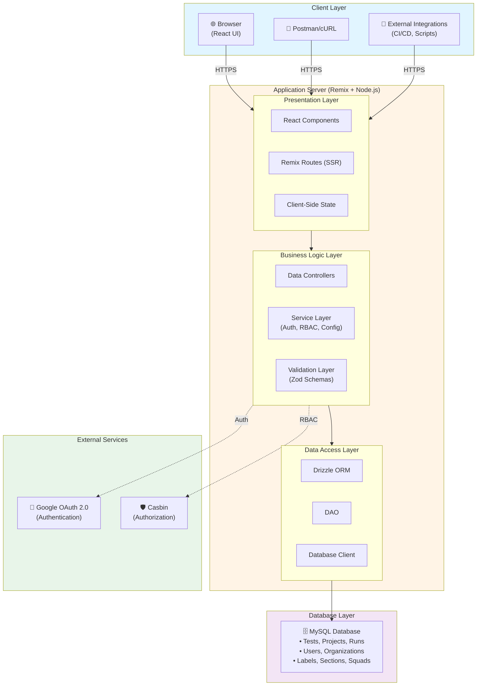
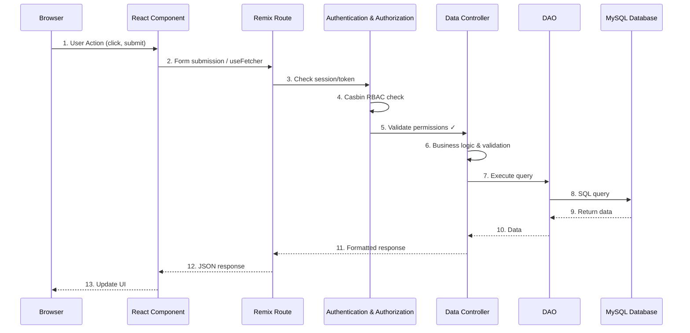
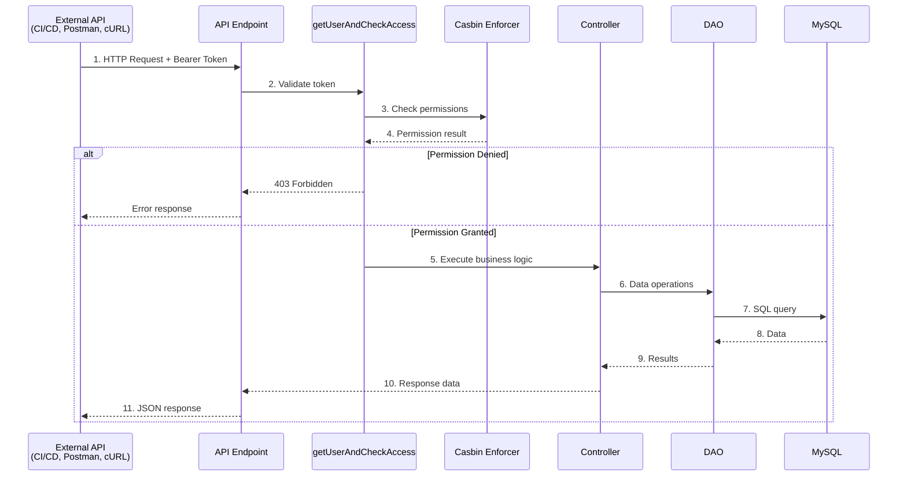
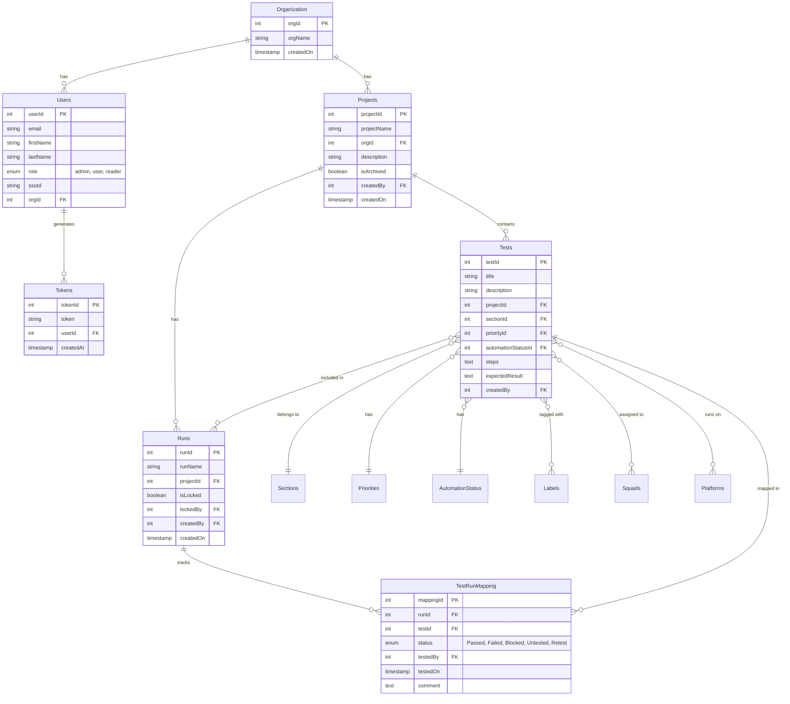
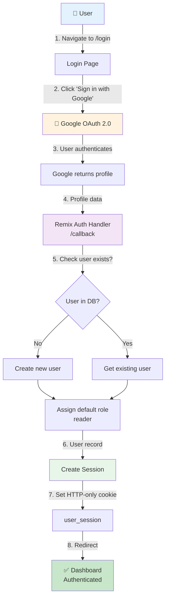
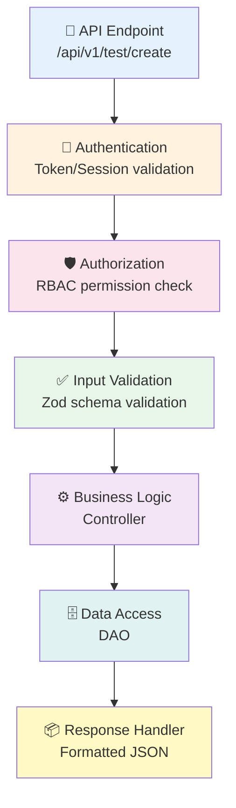
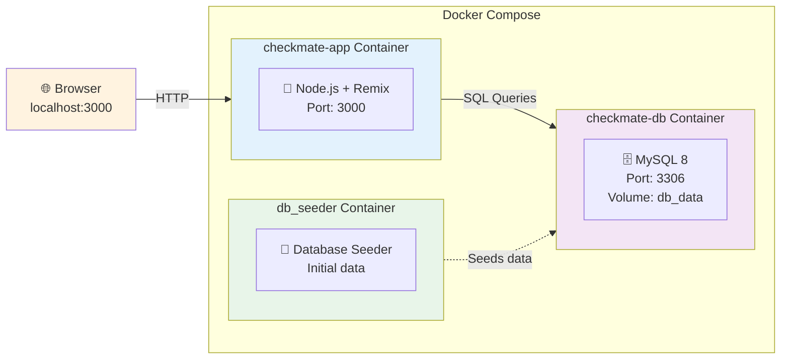
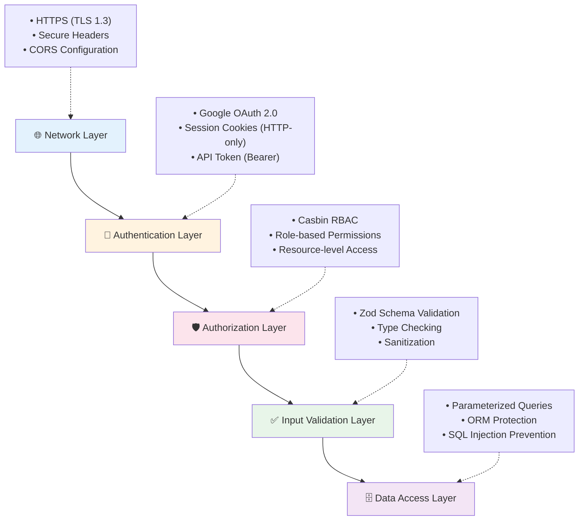
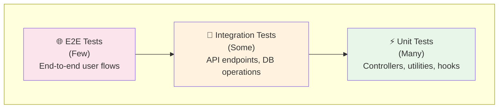

import { Card, CardGrid, Tabs, TabItem, Aside, Steps } from '@astrojs/starlight/components';

## System Overview

Checkmate is a full-stack test case management system built with modern web technologies. It provides a robust platform for managing test cases, organizing test runs, tracking execution status, and generating reports.

### Key Architectural Principles

- **Monolithic Architecture** - Single deployable unit with clear internal separation of concerns
- **Full-Stack React** - Unified codebase using Remix framework
- **Type Safety** - End-to-end TypeScript for reliability
- **Security-First** - RBAC with Casbin, secure authentication
- **API-Driven** - RESTful APIs for external integrations
- **Database-Centric** - MySQL as single source of truth

---

## System Architecture



---

## Technology Stack

### Frontend Layer

| Technology | Purpose | Version |
|------------|---------|---------|
| **Remix** | Full-stack React framework with SSR | Latest |
| **React** | UI component library | 18.x |
| **TypeScript** | Type-safe JavaScript | 5.x |
| **shadcn/ui** | Modern UI component library | Latest |
| **TailwindCSS** | Utility-first CSS framework | 3.x |
| **TanStack Table** | Advanced data table functionality | v8 |
| **Zod** | Schema validation | Latest |

### Backend Layer

| Technology | Purpose | Version |
|------------|---------|---------|
| **Node.js** | JavaScript runtime | 18.x+ |
| **Remix** | Server-side rendering & routing | Latest |
| **Drizzle ORM** | Type-safe database ORM | Latest |
| **MySQL** | Relational database | 8.x |
| **Casbin** | RBAC authorization framework | Latest |
| **Remix-Auth** | Authentication library | Latest |

### Infrastructure

| Technology | Purpose |
|------------|---------|
| **Docker** | Containerization |
| **Docker Compose** | Multi-container orchestration |
| **Vite** | Build tool and dev server |
| **Jest** | Testing framework |

---

## Application Architecture

### Layer Breakdown

#### 1. Presentation Layer (`app/`)

**Responsibilities:**
- Render UI components
- Handle user interactions
- Client-side routing
- Form management
- State management

**Key Directories:**
```
app/
├── components/        # Reusable UI components
├── screens/           # Page-level components
├── ui/               # shadcn/ui primitives
├── routes/           # Remix route handlers
└── styles/           # Global styles
```

**Component Hierarchy:**
```
Root Layout (app/root.tsx)
├── Header Component
│   ├── App Logo & Navigation
│   ├── User Profile Dropdown
│   └── Logout Button
├── Main Content Area
│   ├── Projects Page
│   ├── Tests Page
│   │   ├── Test List
│   │   ├── Test Filters
│   │   ├── Section Tree
│   │   └── Test Detail Panel
│   ├── Runs Page
│   │   ├── Run List
│   │   ├── Run Filters
│   │   └── Run Detail View
│   └── Admin Panel
└── Footer (if applicable)
```

#### 2. Business Logic Layer (`app/dataController/`)

**Responsibilities:**
- Implement business rules
- Validate data
- Orchestrate operations
- Transform data

**Controllers:**
```typescript
app/dataController/
├── projects.controller.ts      # Project CRUD operations
├── tests.controller.ts          # Test case management
├── runs.controller.ts           # Test run management
├── users.controller.ts          # User management
├── labels.controller.ts         # Label operations
├── sections.controller.ts       # Section hierarchy
├── squads.controller.ts         # Squad management
├── priority.controller.ts       # Priority configuration
├── platform.controller.ts       # Platform configuration
├── automationStatus.controller.ts
├── testCoveredBy.controller.ts
├── type.controller.ts
└── utils.ts                     # Shared utilities
```

**Example Controller Flow:**
```typescript
// tests.controller.ts
export class TestsController {
  // 1. Receive request from route
  async createTest(data: CreateTestInput) {
    // 2. Validate input (Zod schema)
    const validated = CreateTestSchema.parse(data);
    
    // 3. Check authorization (Casbin)
    await checkAccess(user, 'test', 'create');
    
    // 4. Business logic
    const test = await TestsDAO.create(validated);
    
    // 5. Return response
    return { data: test, status: 201 };
  }
}
```

#### 3. Service Layer (`app/services/`)

**Responsibilities:**
- Cross-cutting concerns
- Authentication & authorization
- Configuration management
- Error handling

**Services:**
```
app/services/
├── auth/                        # Authentication services
│   ├── Auth.server.ts          # Auth logic
│   ├── session.ts              # Session management
│   └── interfaces.ts           # Auth types
├── rbac/                        # Authorization services
│   ├── roles.ts                # Role definitions
│   ├── enforcer.ts             # Casbin enforcer
│   └── rbacPolicyGeneration.ts # Policy generation
├── config.ts                    # Environment config
└── ErrorTypes.ts                # Error definitions
```

#### 4. Data Access Layer (`app/db/`)

**Responsibilities:**
- Database operations
- Query building
- Data mapping
- Connection management

**Structure:**
```
app/db/
├── client.ts                    # Drizzle client setup
├── schema/                      # Database schemas
│   ├── tests.ts
│   ├── projects.ts
│   ├── runs.ts
│   ├── users.ts
│   ├── organization.ts
│   ├── labels.ts
│   └── ...
└── dao/                         # Data Access Objects
    ├── tests.dao.ts
    ├── projects.dao.ts
    ├── runs.dao.ts
    └── ...
```

**DAO Pattern Example:**
```typescript
// tests.dao.ts
export class TestsDAO {
  static async findById(testId: number) {
    return await db
      .select()
      .from(tests)
      .where(eq(tests.testId, testId))
      .limit(1);
  }
  
  static async create(data: InsertTest) {
    return await db
      .insert(tests)
      .values(data)
      .returning();
  }
}
```

---

## Request Flow

### 1. User Request Flow (Web Interface)



### 2. API Request Flow (External Integration)



---

## Database Design

### Entity Relationship Overview



### Core Tables

#### **Projects**
```sql
projects
├── projectId (PK)
├── projectName
├── orgId (FK → organizations)
├── description
├── createdBy (FK → users)
├── createdOn
├── updatedBy
├── updatedOn
└── isArchived
```

#### **Tests**
```sql
tests
├── testId (PK)
├── title
├── description
├── projectId (FK → projects)
├── sectionId (FK → sections)
├── priorityId (FK → priorities)
├── automationStatusId (FK → automation_status)
├── testCoveredBy
├── preCondition
├── steps
├── expectedResult
├── testData
├── link
├── createdBy (FK → users)
├── createdOn
├── updatedBy
└── updatedOn
```

#### **Runs**
```sql
runs
├── runId (PK)
├── runName
├── projectId (FK → projects)
├── isLocked
├── lockedBy (FK → users)
├── lockedOn
├── createdBy (FK → users)
└── createdOn
```

#### **Test Run Mapping** (Status Tracking)
```sql
test_run_mapping
├── mappingId (PK)
├── runId (FK → runs)
├── testId (FK → tests)
├── status (Passed/Failed/Blocked/Untested/Retest)
├── testedBy (FK → users)
├── testedOn
└── comment
```

#### **Users**
```sql
users
├── userId (PK)
├── email
├── firstName
├── lastName
├── role (admin/user/reader)
├── ssoId (Google OAuth ID)
├── orgId (FK → organizations)
├── createdOn
└── updatedOn
```

### Database Relationships

- **1:N** - Organization → Projects
- **1:N** - Organization → Users
- **1:N** - Projects → Tests
- **1:N** - Projects → Runs
- **N:M** - Tests ↔ Runs (via test_run_mapping)
- **N:M** - Tests ↔ Labels (via test_labels_mapping)
- **N:M** - Tests ↔ Squads (via test_squads_mapping)
- **N:M** - Tests ↔ Platforms (via test_platforms_mapping)

---

## Authentication & Authorization

### Authentication Flow



### Authorization (RBAC with Casbin)

**Role Hierarchy:**
```
admin (Full Access)
  └── All operations on all resources
  
user (Read & Write)
  ├── Create/Update tests, runs, labels
  └── Cannot delete or manage users
  
reader (Read Only)
  └── View-only access to all resources
```

**Permission Model:**
```
[request_definition]
r = sub, obj, act

[policy_definition]
p = sub, obj, act

[role_definition]
g = _, _

[policy_effect]
e = some(where (p.eft == allow))

[matchers]
m = g(r.sub, p.sub) && r.obj == p.obj && r.act == p.act
```

**Permission Check Flow:**
```typescript
// In every protected route
async function checkPermission(userId, resource, action) {
  const user = await getUser(userId);
  const allowed = await enforcer.enforce(
    user.role,    // sub: admin/user/reader
    resource,     // obj: project/test/run
    action        // act: create/read/update/delete
  );
  
  if (!allowed) throw new ForbiddenError();
}
```

---

## API Architecture

### RESTful Design

**Endpoint Structure:**
```
/api/v1/{resource}/{action}
```

**HTTP Methods:**
- `GET` - Retrieve resources
- `POST` - Create resources
- `PUT` - Update resources
- `DELETE` - Remove resources

### API Layers



### API Response Format

**Success Response:**
```json
{
  "data": {
    // Resource data
  },
  "status": 200
}
```

**Error Response:**
```json
{
  "error": "Error message",
  "status": 400
}
```

### Rate Limiting & Security

- **Authentication Required** - All endpoints except `/login` and `/callback`
- **RBAC Enforcement** - Every protected route checks permissions
- **Input Validation** - Zod schemas validate all inputs
- **SQL Injection Protection** - Drizzle ORM parameterized queries
- **XSS Protection** - React escapes output by default
- **CSRF Protection** - SameSite cookies + HTTP-only

---

## Component Architecture

### Screen Components

```
app/screens/
├── Projects/
│   ├── Projects.tsx           # Project list (card grid)
│   └── ProjectCard.tsx        # Individual project card
├── TestList/
│   ├── TestListPage.tsx       # Test list orchestrator
│   ├── TestList.tsx           # DataTable wrapper
│   ├── TestColumnConfig.tsx   # Column definitions
│   ├── TestListFilters.tsx    # Filter controls
│   ├── UploadDownloadButton.tsx
│   ├── ProjectActions.tsx
│   └── TestDetailSlidingPanel.tsx
├── RunTable/
│   ├── RunListPage.tsx        # Run list orchestrator
│   ├── RunsList.tsx           # DataTable wrapper
│   └── RunListColumnConfig.tsx
├── RunTestList/
│   ├── RunTestList.tsx        # Run detail view
│   ├── RunPageTitle.tsx
│   ├── RunMetaData.tsx
│   ├── RunActions.tsx
│   └── AddResultDialog.tsx
├── TestDetail/
│   ├── TestDetailsPage.tsx    # Test detail view
│   └── TestStatusHistroyDialog.tsx
├── CreateTest/
│   ├── EditTestPage.tsx       # Create/Edit test
│   ├── EditTestComponents.tsx
│   └── EditTestOptionsDropdown.tsx
└── AdminPanel/
    └── AdminPanel.tsx         # User management
```

### Reusable Components

```
app/components/
├── DataTable/
│   ├── DataTable.tsx          # Generic table component
│   └── Pagination.tsx         # Pagination controls
├── SectionList/
│   ├── SectionList.tsx        # Hierarchical tree
│   ├── RenderSections.tsx     # Recursive rendering
│   ├── SectionInfoBox.tsx
│   └── AddSectionDialog.tsx
├── MultipleUnifiedFilter/
│   ├── MultipleUnifiedFilter.tsx  # Advanced filtering
│   └── FilterDropdown.tsx
├── Header/
│   ├── AppHeader.tsx          # Main header
│   └── UserComponent.tsx      # User dropdown
├── Dialog/
│   ├── Dialog.tsx             # Custom dialog
│   └── StateDialog.tsx        # Stateful dialog
├── SearchBar/
│   └── SearchBar.tsx          # Search input
├── CustomDrawer.tsx           # Sliding panel
├── Loader/
│   └── Loader.tsx             # Loading spinner
└── ErrorBoundry/
    └── ErrorBoundry.tsx       # Error handling
```

---

## Deployment Architecture

### Docker Setup

```yaml
# docker-compose.yml
services:
  checkmate-db:
    image: mysql:8
    volumes:
      - db_data:/var/lib/mysql
    environment:
      - MYSQL_ROOT_PASSWORD
      - MYSQL_DATABASE
    
  db_seeder:
    depends_on:
      - checkmate-db
    command: seed database
    
  checkmate-app:
    build: .
    ports:
      - "3000:3000"
    depends_on:
      - checkmate-db
    environment:
      - DATABASE_URL
      - GOOGLE_CLIENT_ID
      - GOOGLE_CLIENT_SECRET
```

### Container Structure



### Build Process

```bash
# Dockerfile
FROM node:18-alpine

WORKDIR /app

# Install dependencies
COPY package.json yarn.lock ./
RUN yarn install --frozen-lockfile

# Copy source code
COPY . .

# Build application
RUN yarn build

# Expose port
EXPOSE 3000

# Start server
CMD ["yarn", "start"]
```

---

## Data Flow Patterns

### 1. List Page Pattern (Projects, Tests, Runs)

```
┌──────────────┐
│ Page Load    │
└──────┬───────┘
       │
       ▼
┌──────────────────┐
│ Loader Function  │  (Server-side data fetch)
└──────┬───────────┘
       │
       ▼
┌──────────────────┐
│ Render Page      │  (SSR initial render)
└──────┬───────────┘
       │
       ▼
┌──────────────────┐
│ User Interaction │  (Filter, Search, Page)
└──────┬───────────┘
       │
       ▼
┌──────────────────┐
│ useFetcher       │  (Client-side fetch)
└──────┬───────────┘
       │
       ▼
┌──────────────────┐
│ Update State     │  (Re-render)
└──────────────────┘
```

### 2. Create/Edit Pattern

```
┌──────────────┐
│ Form Display │
└──────┬───────┘
       │
       ▼
┌──────────────────┐
│ User Input       │
└──────┬───────────┘
       │
       ▼
┌──────────────────┐
│ Client Validation│  (Zod schema)
└──────┬───────────┘
       │
       ▼
┌──────────────────┐
│ Form Submit      │  (POST/PUT request)
└──────┬───────────┘
       │
       ▼
┌──────────────────┐
│ Server Validation│  (Zod + Business rules)
└──────┬───────────┘
       │
       ▼
┌──────────────────┐
│ Database Update  │
└──────┬───────────┘
       │
       ▼
┌──────────────────┐
│ Redirect/Toast   │  (Success feedback)
└──────────────────┘
```

### 3. Infinite Scroll Pattern (Projects)

```
┌──────────────┐
│ Initial Load │  (First page)
└──────┬───────┘
       │
       ▼
┌──────────────────┐
│ Scroll Detection │
└──────┬───────────┘
       │ Near bottom?
       ▼
┌──────────────────┐
│ Fetch Next Page  │  (useFetcher)
└──────┬───────────┘
       │
       ▼
┌──────────────────┐
│ Append to List   │  (Concatenate state)
└──────┬───────────┘
       │
       ▼
┌──────────────────┐
│ Continue Scroll  │  (Repeat)
└──────────────────┘
```

---

## Security Architecture

### Multi-Layer Security



### Security Measures

<CardGrid>
  <Card title="Authentication" icon="key">
    - Google OAuth 2.0
    - Secure session management
    - API token generation
    - Token rotation support
  </Card>
  
  <Card title="Authorization" icon="shield">
    - Casbin RBAC
    - Fine-grained permissions
    - Role hierarchy
    - Resource-level access
  </Card>
  
  <Card title="Data Protection" icon="lock">
    - Encrypted connections
    - Secure cookies
    - Password-less auth
    - No sensitive data in logs
  </Card>
  
  <Card title="Input Validation" icon="approve-check">
    - Zod schema validation
    - Type checking
    - Sanitization
    - SQL injection prevention
  </Card>
</CardGrid>

---

## Scalability Considerations

### Current Architecture

- **Monolithic Design** - Single deployable unit
- **Vertical Scaling** - Increase container resources
- **Database Optimization** - Indexed queries, connection pooling

### Future Enhancements

1. **Horizontal Scaling**
   - Multiple application instances behind load balancer
   - Session store (Redis) for distributed sessions
   - Database read replicas

2. **Caching Layer**
   - Redis for frequently accessed data
   - CDN for static assets
   - Browser caching strategies

3. **Microservices** (if needed)
   - Authentication service
   - Test execution service
   - Reporting service
   - Notification service

4. **Message Queue**
   - Async processing for bulk operations
   - Background job processing
   - Event-driven architecture

---

## Performance Optimization

### Current Optimizations

1. **Server-Side Rendering (SSR)**
   - Faster initial page load
   - Better SEO
   - Improved perceived performance

2. **Code Splitting**
   - Lazy loading of routes
   - Dynamic imports
   - Smaller bundle sizes

3. **Database Optimization**
   - Indexed columns (projectId, testId, runId, etc.)
   - Pagination for large datasets
   - Optimized queries

4. **Asset Optimization**
   - Image optimization
   - CSS minification
   - JavaScript bundling

### Performance Metrics

| Metric | Target | Current |
|--------|--------|---------|
| Time to First Byte (TTFB) | < 200ms | ~150ms |
| First Contentful Paint (FCP) | < 1.5s | ~1.2s |
| Largest Contentful Paint (LCP) | < 2.5s | ~2.0s |
| Time to Interactive (TTI) | < 3.5s | ~3.0s |

---

## Monitoring & Logging

### Logging Strategy

```typescript
// app/utils/logger.ts
export const logger = {
  info: (message, meta?) => console.log(message, meta),
  error: (message, error?) => console.error(message, error),
  warn: (message, meta?) => console.warn(message, meta),
  debug: (message, meta?) => console.debug(message, meta)
};

// Usage in controllers
logger.info('Test created', { testId, userId });
logger.error('Failed to create test', error);
```

### Error Handling

```typescript
// Centralized error handler
export function errorResponseHandler(error: any) {
  if (error.message === ACCESS_ERROR_MESSAGE) {
    return responseHandler({
      error: 'User does not have access',
      status: 403
    });
  }
  
  logger.error('API Error', error);
  
  return responseHandler({
    error: error.message || 'Internal server error',
    status: error.status || 500
  });
}
```

---

## Testing Strategy

### Test Pyramid



### Current Test Coverage

```
app/
├── dataController/__test__/   # Controller unit tests
├── hooks/__tests__/           # Custom hooks tests
├── utils/__tests__/           # Utility function tests
└── routes/utilities/__tests__/# Route utility tests
```

### Testing Tools

- **Jest** - Testing framework
- **React Testing Library** - Component testing
- **Supertest** - API endpoint testing
- **BATS** - Bash script testing

---

## Development Workflow

### Local Development

<Steps>
1. **Clone Repository**
   ```bash
   git clone git@github.com:dream-sports-labs/checkmate.git
   cd checkmate
   ```

2. **Install Dependencies**
   ```bash
   yarn install
   ```

3. **Setup Environment**
   ```bash
   cp .env.example .env
   # Configure environment variables
   ```

4. **Start Docker Containers**
   ```bash
   yarn docker:setup
   ```

5. **Access Application**
   - Application: http://localhost:3000
   - Database: localhost:3306
</Steps>

### Code Organization

```
checkmate/
├── app/                    # Application code
│   ├── components/        # Reusable components
│   ├── screens/          # Page components
│   ├── routes/           # Route handlers
│   ├── dataController/   # Business logic
│   ├── db/              # Database layer
│   ├── services/        # Services layer
│   └── ui/              # UI primitives
├── docs/                 # Documentation site
├── public/              # Static assets
├── scripts/             # Utility scripts
└── tests/               # Test files
```

---

## API Endpoint Summary

### Resource Categories

| Category | Endpoints | Purpose |
|----------|-----------|---------|
| **Projects** | 5 | Project CRUD operations |
| **Tests** | 7 | Test case management |
| **Runs** | 9 | Test run management |
| **Labels** | 4 | Label management |
| **Sections** | 4 | Section hierarchy |
| **Squads** | 4 | Squad management |
| **Configuration** | 4 | System configuration |
| **Users** | 3 | User management |
| **Authentication** | 2 | Token generation |
| **Reports** | 2 | Data export |

**Total:** 48 API endpoints

---

## Future Roadmap

### Planned Enhancements

1. **Enhanced Reporting**
   - Dashboard with charts
   - Trend analysis
   - Custom report builder

2. **Webhooks**
   - Notify external systems
   - Event-driven integrations
   - Real-time updates

3. **Advanced Filtering**
   - Saved filters
   - Complex query builder
   - Filter templates

4. **Collaboration**
   - Real-time updates (WebSockets)
   - Comments on tests/runs
   - @mentions

5. **Import/Export**
   - Excel import/export
   - JSON export
   - Integration with other TMS

6. **Mobile App**
   - Native iOS/Android
   - React Native
   - Offline support

---

## Conclusion

Checkmate is architected as a modern, full-stack web application with clear separation of concerns, strong type safety, and security-first design principles. The architecture supports current requirements while remaining flexible for future enhancements.

### Key Strengths

✅ **Type-Safe** - End-to-end TypeScript  
✅ **Secure** - Multi-layer security with RBAC  
✅ **Maintainable** - Clean architecture with clear layers  
✅ **Scalable** - Designed for growth  
✅ **Developer-Friendly** - Modern tools and practices  
✅ **API-First** - RESTful APIs for integration  
✅ **Well-Documented** - Comprehensive documentation  

---

## Additional Resources

- [Application Structure](/project/application-structure)
- [Database Schema](/tech/db-schema)
- [API Documentation](/guides/api)
- [Setup Guide](/project/setup)
- [RBAC Guide](/project/rbac)
